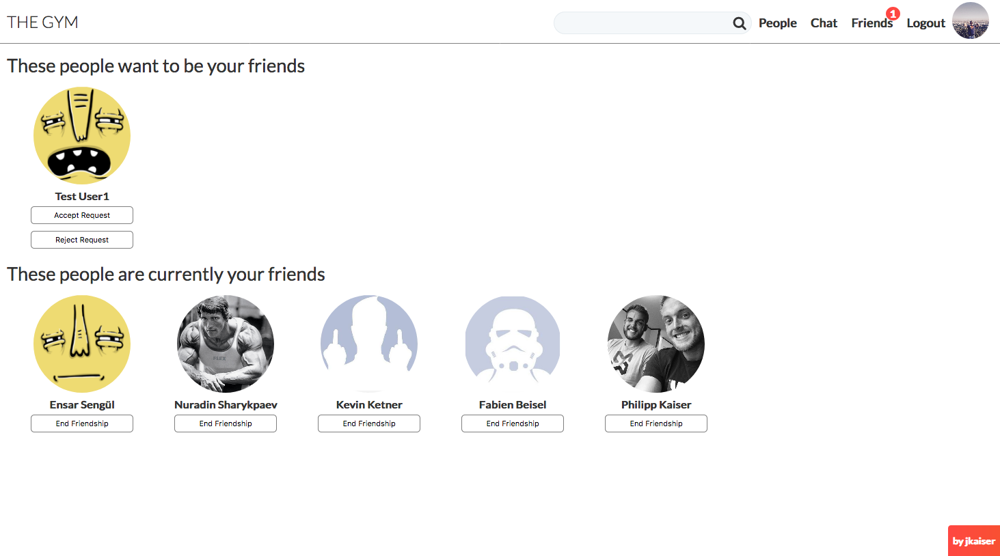

# Social Network "The Gym"

## Summary
A social network project. This website is a single-page application made with React. The main goal of this app is to connect likeminded fitness enthusiasts. If someone is looking for a new workout partner or just wants to share tips and hacks about their fitness journey they can connect on this website.

## Tech Stack
* React.js and Redux
* Express.js on Node.js
* PostgreSQL Database
* socket.io
* AWS S3 Cloud Storage
* Webpack as a module bundler

## Features
* The website includes user registration and user login as well as logout.
* Users can change their profile picture as well as their larger cover picture.
* Users can change their bio on their personal profile.
* Users can find other users by visiting friends profiles and see a list of their friends.
* Users can also search through all other members of the social network using the search bar in the menu (database queries with pattern matching).
* Users can see in real-time other users that are online.
* Users also have access to a public chat.
* Users can see a list of pending friend requests and list of friends.
* Users will be notified in real-time if they receive a new friendship request.

****

****

****

****

****

